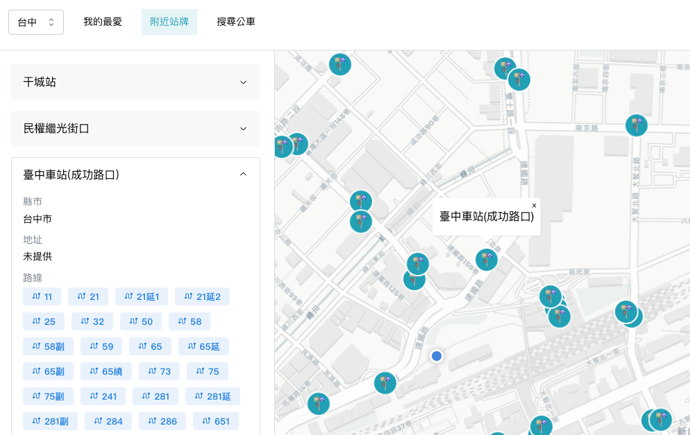

# Finding the Bus

A bus-focused single-page application for route lookup, nearby stops, and real-time transit information in Taiwan.

## Screenshot



## Features

### Route Search

Search bus routes by service area and keyword.

- The Routes page defaults to the area resolved from the user's current location.
- If the user manually changes the area, that selection is preserved while they continue browsing.
- Search keywords are also preserved when returning to the Routes page during the same session.
- Matching routes open a route detail page with subroute tabs, stop lists, and a synchronized map.

### Route Detail

The Route page combines stop lists, map interaction, and real-time transit data.

- Official route shape data is used for more accurate route lines on the map when available.
- The stop list and map stay in sync: selecting a stop in one view updates the other.
- Each stop shows stop-level ETA based directly on `EstimatedTimeOfArrival` when upstream ETA data is available.
- Real-time vehicle plates are shown as separate location cues in the stop list and do not define the stop ETA.
- Real-time buses are displayed on the route map when live vehicle data is available.
- The app shows real-time status messaging such as temporary data issues or non-operating service periods.

### Nearby Stops

The Nearby Stops page uses the user's current GPS location.

- If location permission is granted, the app resolves the current city and service area automatically.
- Stops within **0.5 kilometers** are shown as both a list and map markers.
- Selecting a stop reveals stop details, including its city, address, and serving route badges.
- Opening a stop's route detail view shows the full route list grouped by direction.

If location permission is denied, the Nearby Stops feature becomes unavailable.

### Favorites

The Favorites page stores route-stop combinations for quick access.

- Each favorite keeps the route, subroute, direction, and a specific stop.
- Opening a favorite jumps back into the matching Route page and highlights the saved stop.

### Language Settings

The app currently supports both `zh-TW` and `en`.

- Users can switch the interface language from the Settings page.
- The selected language is saved in local storage and restored on the next visit.

## Tech Stack

- **Framework:** React SPA with React Router v7
- **Language:** TypeScript
- **UI:** Mantine
- **State and Data:** Redux Toolkit and RTK Query
- **Maps:** MapLibre GL JS with CARTO raster tiles
- **API Proxy:** Cloudflare Workers
- **Worker Tooling:** Wrangler
- **Geospatial Utilities:** Turf.js
- **Testing:** Vitest and React Testing Library
- **Tooling:** Vite, ESLint, pnpm

## Project Structure

The app is organized around route-level pages, feature components, and shared domain modules.

```text
app/
├── components/        # Shared and feature UI
├── modules/
│   ├── apis/          # RTK Query APIs
│   ├── consts/        # Shared constants and UI copy
│   ├── enums/         # Domain enums
│   ├── hooks/         # Reusable hooks
│   ├── i18n/          # Locale setup and translation resources
│   ├── interfaces/    # Domain and API models
│   ├── slices/        # Redux slices
│   ├── types/         # Shared type helpers
│   ├── utils/         # Shared helpers grouped by domain
│   │   ├── favorite/  # Favorite persistence normalization
│   │   ├── geo/       # Coordinate, area, city, and nearby query helpers
│   │   ├── i18n/      # Localized text and label helpers
│   │   ├── map/       # Map marker DOM helpers
│   │   ├── route/     # Route data transforms, realtime, and shape helpers
│   │   └── shared/    # Small cross-domain utilities
│   └── store.ts       # Redux store
├── pages/             # Route pages, including Favorite, Routes, Nearby, Route, and Settings
├── test/              # Shared test setup and render helpers
├── root.tsx           # App root
└── routes.ts          # Route definitions

workers/
└── tdx-proxy/         # Cloudflare Worker proxy
```

## Open Data

The project relies on two external open data sources.

### TDX Bus API

`https://tdx.transportdata.tw/api/basic/v2/Bus`

TDX, short for Transport Data eXchange, provides the route, stop, realtime, and shape data used by this app. Frontend requests go through a Cloudflare Worker proxy that handles TDX authentication.

The app uses TDX data for:

- route search and route detail lookups
- stop and station discovery for nearby views
- stop-level ETA and realtime vehicle location
- official route shape rendering on maps

Current endpoint usage:

| Endpoint | Used For |
| --- | --- |
| `/Route/City/:city` | route search and route detail |
| `/StopOfRoute/City/:city` | route stop lists and nearby route relationships |
| `/Stop/City/:city` | nearby stop discovery and map stop positions |
| `/EstimatedTimeOfArrival/City/:city` | stop-level ETA |
| `/RealTimeNearStop/City/:city` | realtime vehicle positions and stop-list vehicle cues |
| `/Shape/City/:city` | route map path rendering |

Realtime data is best-effort and may be temporarily unavailable when the shared proxy-backed key hits upstream rate limits.

### Taiwan County Boundaries

Boundary data comes from the counties dataset in [dkaoster/taiwan-atlas](https://github.com/dkaoster/taiwan-atlas):

`https://cdn.jsdelivr.net/npm/taiwan-atlas/counties-10t.json`

The app converts that TopoJSON dataset into GeoJSON to determine the user's city and area for nearby-stop and route-search flows.

## Development

### Install dependencies

```bash
pnpm install
```

### Set environment variables

1. Copy `workers/tdx-proxy/.dev.vars.example` to `workers/tdx-proxy/.dev.vars`.
2. Fill in `TDX_CLIENT_ID`, `TDX_CLIENT_SECRET`, and `TDX_ALLOWED_ORIGINS`.
3. The frontend is already pointed at the local Worker in `.env.development`:

```env
VITE_PROXY_API_BASE_URL=http://127.0.0.1:3000/api/tdx
```

### Run locally

Start local development with:

```bash
pnpm run dev
```

This starts both the frontend dev server and the local Cloudflare Worker proxy.

### Test

```bash
pnpm run lint
pnpm run typecheck
pnpm test
```

## Deployment Notes

The frontend is deployed as a static app, while TDX authentication is handled by a separate Cloudflare Worker proxy.

1. Store `TDX_CLIENT_ID`, `TDX_CLIENT_SECRET`, and `TDX_ALLOWED_ORIGINS` in Cloudflare Worker environment bindings.
2. Deploy the Worker with `pnpm run deploy:proxy`.
3. Store `VITE_PROXY_API_BASE_URL` as a GitHub Actions repository variable.
4. Let the GitHub Pages build inject that value during `pnpm run build`.
