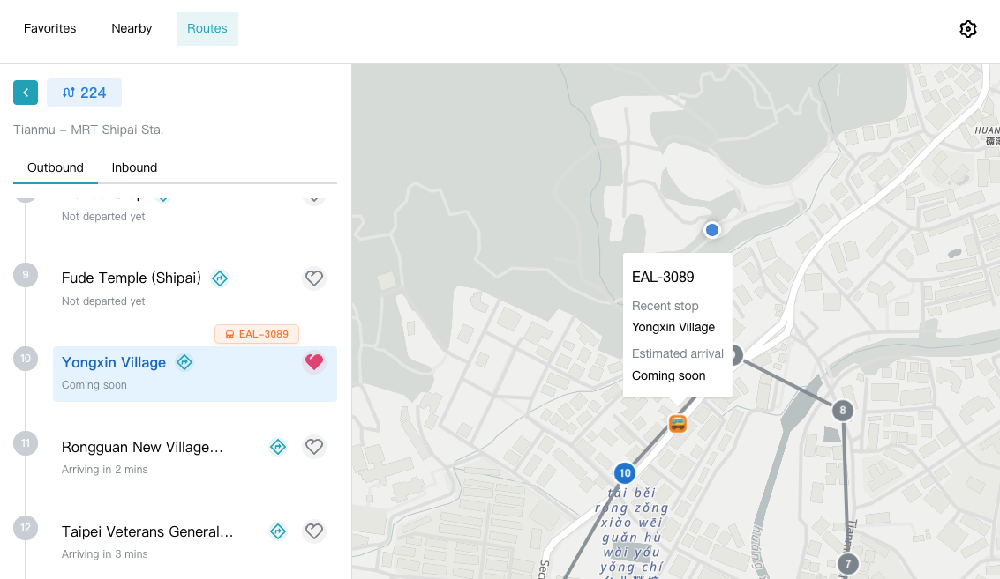

# Finding the Bus

[English](./README.md) | [繁體中文](./docs/README.zh-TW.md)

A Taiwan bus app organized as a pnpm monorepo. It started as a frontend-only project and is gradually growing into a clearer frontend/backend architecture.

The current production app is the React Router frontend for route lookup, nearby stops, favorites, language settings, and realtime transit information. Backend, database sync, and shared API contracts will be introduced step by step.

## Workspaces

```text
apps/
├── web/          # React Router frontend
├── tdx-proxy/    # Cloudflare Worker proxy for TDX authentication
└── api/          # Planned NestJS backend

packages/
└── shared/       # Planned shared API contracts and domain types
```

## Workspace Docs

| Workspace | Purpose | Docs |
| --- | --- | --- |
| `apps/web` | User-facing React Router app | [apps/web/README.md](./apps/web/README.md) |
| `apps/tdx-proxy` | Cloudflare Worker proxy for TDX auth | [apps/tdx-proxy/README.md](./apps/tdx-proxy/README.md) |
| `apps/api` | Planned NestJS backend | [apps/api/README.md](./apps/api/README.md) |
| `packages/shared` | Planned shared API contracts and domain types | [packages/shared/README.md](./packages/shared/README.md) |

For the backend and database direction, start with [docs/plan.md](./docs/plan.md).

## How To Use

Visit [bus.lynns.me](https://bus.lynns.me) to use the current frontend version.



## Setup

Install dependencies:

```bash
pnpm install
```

Set up the local TDX proxy. This keeps local development behind the Worker proxy instead of putting TDX credentials in the frontend:

```bash
cp apps/tdx-proxy/.dev.vars.example apps/tdx-proxy/.dev.vars
```

Then fill in `TDX_CLIENT_ID` and `TDX_CLIENT_SECRET` in `.dev.vars`.

## Development

For day-to-day development, start both the frontend dev server and local Worker proxy from the root:

```bash
pnpm run dev
```

For mobile testing on the same local network:

```bash
pnpm run dev:mobile
```

## Checks

To check the whole workspace:

```bash
pnpm run lint
pnpm run typecheck
pnpm run test
```

If the change only touches the frontend, run the web workspace checks:

```bash
pnpm --filter @bus/web lint
pnpm --filter @bus/web typecheck
pnpm --filter @bus/web test
```

## Deployment

The GitHub Actions workflow currently builds and deploys only `@bus/web` to GitHub Pages.

The TDX proxy is still deployed manually so frontend deploys do not automatically roll the Worker:

```bash
pnpm --filter @bus/tdx-proxy deploy
```

The planned NestJS backend is not deployed yet.
