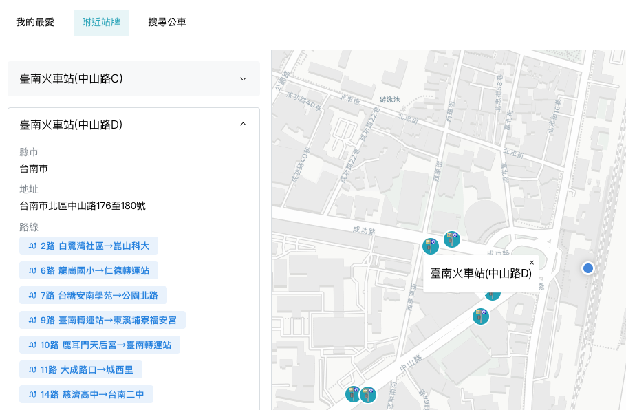

# Finding the Bus

[English](./README.md) | [繁體中文](./README.zh-TW.md)

這是一個以台灣公車查詢為主的單頁應用，提供路線搜尋、附近站牌，以及即時公車資訊。

## 畫面預覽



## 功能特色

### 搜尋公車

可以依服務區域與關鍵字搜尋公車路線。

- `Routes` 頁預設會帶入目前定位推得的區域。
- 如果使用者手動切換區域，這個選擇會在同一次瀏覽期間保留。
- 搜尋關鍵字也會在同一次瀏覽期間保留，方便回到頁面後繼續查。
- 點進路線之後，會進入路線詳情頁，裡面有子路線分頁、站序列表和同步地圖。

### 路線詳情

`Route` 頁整合了站序列表、地圖互動，以及即時公車資料。

- 如果有官方路線 shape，地圖會優先使用它來呈現更準確的路線軌跡。
- 站序列表和地圖會保持同步，從任一邊選擇站點，另一邊也會跟著高亮。
- 每一站的 ETA 直接以 `EstimatedTimeOfArrival` 為準。
- 即時車牌只作為車輛位置提示，不會拿來覆蓋站點 ETA 的語意。
- 有即時公車資料時，地圖上也會顯示行駛中的車輛。
- 畫面也會顯示即時資料異常、收班或暫停營運等狀態訊息。

### 附近站牌

`Nearby` 頁會使用使用者目前的 GPS 位置。

- 使用者允許定位後，系統會自動推得目前所在的城市與服務區域。
- **0.5 公里**內的站牌會同時顯示在列表和地圖上。
- 選擇站牌後，可以查看站牌的詳細資訊，例如縣市、地址和經過路線。
- 展開該站的路線明細後，可以依方向查看完整的路線列表。

如果使用者拒絕位置權限，附近站牌功能將無法使用。

### 我的最愛

`Favorite` 頁會儲存「路線 + 子路線 + 特定站牌」這種組合，方便快速回到常用站點。

- 每筆收藏都會記住路線、子路線、方向和對應站牌。
- 從收藏開啟時，會回到對應的 `Route` 頁，並自動高亮已儲存的站點。

### 語言設定

目前支援 `zh-TW` 與 `en` 兩種語系。

- 使用者可以在 `Settings` 頁切換介面語言。
- 選定的語言會存進 local storage，重新開啟後會自動還原。
- 靜態 UI 文案來自共用翻譯資源。
- TDX API 回傳的 route、subroute、stop、departure、destination 文字也會跟著目前語系顯示；在英文模式下會優先使用 `en`，如果英文資料缺值，則回退到 `zh-TW`。

## 技術棧

- **Framework:** React SPA with React Router v7
- **Language:** TypeScript
- **UI:** Mantine
- **State and Data:** Redux Toolkit 與 RTK Query
- **Maps:** MapLibre GL JS 搭配 CARTO raster tiles
- **API Proxy:** Cloudflare Workers
- **Worker Tooling:** Wrangler
- **Geospatial Utilities:** Turf.js
- **Testing:** Vitest 與 React Testing Library
- **Tooling:** Vite、ESLint、pnpm

## 專案結構

這個專案主要是用頁面、功能元件和共用模組來組織。

```text
app/
├── components/        # 共用與功能型 UI 元件
├── modules/
│   ├── apis/          # RTK Query API 定義
│   ├── consts/        # 共用常數與 UI 文案
│   ├── enums/         # 領域列舉
│   ├── hooks/         # 可重用 hooks
│   ├── i18n/          # 語系設定與翻譯資源
│   ├── interfaces/    # API 與領域模型
│   ├── slices/        # Redux slices
│   ├── types/         # 共用型別工具
│   ├── utils/         # 依領域分組的共用 helper
│   │   ├── favorite/  # Favorite persistence normalization
│   │   ├── geo/       # 座標、區域、城市與 nearby query helper
│   │   ├── i18n/      # localized text 與 translation key helper
│   │   ├── map/       # 地圖 marker DOM helper
│   │   ├── route/     # 路線資料轉換、即時資訊與 shape helper
│   │   └── shared/    # 小型跨領域工具
│   └── store.ts       # Redux store
├── pages/             # Route pages，例如 Favorite、Routes、Nearby、Route、Settings
├── test/              # 共用 test setup 與 render helpers
├── root.tsx           # App root
└── routes.ts          # 路由定義

workers/
└── tdx-proxy/         # Cloudflare Worker proxy
```

## 開放資料來源

這個專案主要依賴兩個外部的開放資料來源。

### TDX Bus API

`https://tdx.transportdata.tw/api/basic/v2/Bus`

TDX（運輸資料流通服務）提供本專案所需的路線、站牌、即時資料和路線 shape。前端不直接向 TDX 做驗證，而是透過 Cloudflare Worker proxy 轉發請求。

目前專案中使用 TDX 資料的情境包括：

- 路線搜尋與路線詳情查詢
- 附近站牌與站點關聯路線查詢
- 站點 ETA 與即時車輛位置
- 官方路線 shape 在地圖上的呈現

目前使用的 endpoint：

| Endpoint | 用途 |
| --- | --- |
| `/Route/City/:city` | 路線搜尋與路線詳情 |
| `/StopOfRoute/City/:city` | 站序列表與 nearby route 關聯 |
| `/Stop/City/:city` | 附近站牌與地圖站點位置 |
| `/EstimatedTimeOfArrival/City/:city` | 站點 ETA |
| `/RealTimeNearStop/City/:city` | 即時車輛位置與站序列表上的車輛提示 |
| `/Shape/City/:city` | 路線地圖軌跡 |

即時資料屬於 best-effort；當多人共用的 proxy key 遇到上游 rate limit 時，資料可能會暫時不可用。

### 台灣縣市邊界資料

邊界資料來自 [dkaoster/taiwan-atlas](https://github.com/dkaoster/taiwan-atlas) 的 counties dataset：

`https://cdn.jsdelivr.net/npm/taiwan-atlas/counties-10t.json`

本專案會把這份 TopoJSON 轉成 GeoJSON，用來推得使用者目前所在的城市與區域，以支援 nearby 和 route search flow。

## 開發

### 安裝依賴

```bash
pnpm install
```

### 設定環境變數

1. 將 `workers/tdx-proxy/.dev.vars.example` 複製為 `workers/tdx-proxy/.dev.vars`。
2. 填入 `TDX_CLIENT_ID`、`TDX_CLIENT_SECRET` 與 `TDX_ALLOWED_ORIGINS`。
3. 前端在 `.env.development` 中已經預設指向本地 Worker：

```env
VITE_PROXY_API_BASE_URL=http://127.0.0.1:3000/api/tdx
```

### 本地執行

```bash
pnpm run dev
```

這會同時啟動前端 dev server 和本地的 Cloudflare Worker proxy。

### 測試

```bash
pnpm run lint
pnpm run typecheck
pnpm test
```

## 部署說明

前端會以靜態網站部署，TDX 驗證則交由獨立的 Cloudflare Worker proxy 處理。

1. 在 Cloudflare Worker environment bindings 中設定 `TDX_CLIENT_ID`、`TDX_CLIENT_SECRET` 與 `TDX_ALLOWED_ORIGINS`。
2. 使用 `pnpm run deploy:proxy` 部署 Worker。
3. 在 GitHub Actions repository variable 中設定 `VITE_PROXY_API_BASE_URL`。
4. 讓 GitHub Pages build 在 `pnpm run build` 時注入該值。
