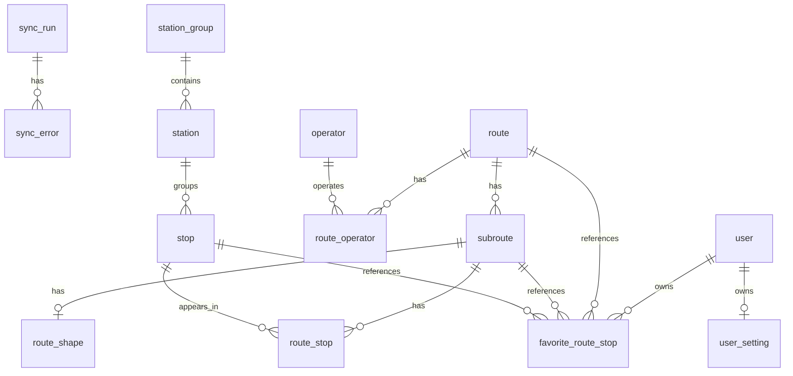

# Database Plan

This document records the planned database tables and relationships for the API.

It is not a Prisma schema yet. The goal is to make the data model easier to discuss before writing migrations.

## Scope

First database scope:

- routes
- subroutes
- station groups
- stations
- stops
- route stops
- route shapes
- sync records

Out of scope for the first database pass:

- realtime ETA cache
- realtime vehicle snapshots
- user accounts
- favorites sync
- settings sync

## General Rules

- Use `snake_case` for database columns.
- Use `uuid` for stable public or TDX identifiers.
- Use `id` for internal database relations.
- Store localized text as separate columns for now:
  - `name_zh_tw`
  - `name_en`
- Store coordinates as:
  - `latitude`
  - `longitude`
- Keep TDX update time as `tdx_updated_at`.
- Keep local row timestamps as `created_at` and `updated_at`.
- Use soft delete for base data that may be referenced by favorites:
  - `is_active`
  - `inactive_at`
- Favorite rows can be hard deleted when the user removes a favorite.

## Relationship Draft



## Current Decisions

### ORM

Use Prisma.

### Area

Do not store `area` in the first schema.

The API can map `area` to a list of cities when querying data.

### Station Group, Station, And Stop

Keep `station_group`, `station`, and `stop` as separate tables.

TDX has separate concepts for station groups, stations, and stops. They are different levels of location data, so the first schema should keep them separate instead of merging them into one table.

Relationship:

- `station_group` can contain many `station` rows.
- `station` can contain many `stop` rows.
- `stop` is the record used by `route_stop` for route sequence data.

Foreign keys should be nullable where TDX data is incomplete:

- `station.station_group_id` can be null.
- `stop.station_id` can be null.

This keeps both TDX UUIDs available while avoiding a hard assumption that every city has complete station group data.

### Route Shape

The frontend currently renders route paths as:

```ts
type LngLat = [longitude: number, latitude: number]
```

The current frontend transform prefers:

1. TDX `EncodedPolyline`
2. TDX `Geometry`
3. fallback from ordered stop positions

Store the readable path as JSON:

```json
[
  [121.4984, 25.0018],
  [121.5021, 25.0042]
]
```

Also keep the original TDX fields when available:

- `encoded_polyline`
- `geometry`
- `source`

`source` can be:

- `encoded_polyline`
- `geometry`
- `stop_positions`

### PostGIS

Do not use PostGIS in the first schema.

PostGIS is a PostgreSQL extension for geographic queries and spatial indexes. It may be useful later for nearby station search, but the first version can use normal `latitude` and `longitude` columns.

### Address Translation

Store translated English addresses, but do not translate on every sync.

Fields:

- `address_zh_tw`
- `address_en`

TDX does not provide the English address. `address_en` is translated from `address_zh_tw`.

When syncing, compare the incoming Chinese address with the stored `address_zh_tw`.

- If the Chinese address is unchanged, keep `address_en`.
- If the Chinese address changed, update `address_zh_tw`, clear `address_en`, and fall back to the Chinese address until it is translated again.

### Realtime Data

Do not store realtime snapshots in PostgreSQL in the first schema.

Use direct TDX calls or a short in-memory cache first. If deployment or cache needs become more complex, consider Redis later.

### Soft Delete

Use soft delete for base data.

Favorites may reference routes or stops. If TDX no longer returns a route or stop, keep the row and mark it inactive so the UI can show that the favorite item is no longer active.

This does not mean favorite rows need soft delete. If the user removes a favorite, delete that favorite row directly.

## Tables

### route

One bus route.

TDX source:

- `/v2/Bus/Route/City/{City}`

Fields:

- `id`
- `uuid`
- `tdx_route_id`
- `city`
- `name_zh_tw`
- `name_en`
- `departure_zh_tw`
- `departure_en`
- `destination_zh_tw`
- `destination_en`
- `is_active`
- `inactive_at`
- `tdx_updated_at`
- `created_at`
- `updated_at`

Relations:

- has many `subroute`
- has many `route_operator`

### subroute

One route direction or route variant.

TDX source:

- `SubRoutes` from `/v2/Bus/Route/City/{City}`
- route data from `/v2/Bus/StopOfRoute/City/{City}`

Fields:

- `id`
- `uuid`
- `tdx_subroute_id`
- `route_id`
- `direction`
- `name_zh_tw`
- `name_en`
- `departure_zh_tw`
- `departure_en`
- `destination_zh_tw`
- `destination_en`
- `first_bus_time`
- `last_bus_time`
- `is_active`
- `inactive_at`
- `tdx_updated_at`
- `created_at`
- `updated_at`

Relations:

- belongs to `route`
- has many `route_stop`
- has one `route_shape`

### station_group

A TDX station group.

TDX source:

- `/v2/Bus/StationGroup/City/{City}`

Fields:

- `id`
- `uuid`
- `tdx_station_group_id`
- `city`
- `name_zh_tw`
- `name_en`
- `latitude`
- `longitude`
- `is_active`
- `inactive_at`
- `tdx_updated_at`
- `created_at`
- `updated_at`

Relations:

- has many `station`

### station

A passenger-facing station or station location.

TDX source:

- `/v2/Bus/Station/City/{City}`
- can be derived from stop data when needed

Fields:

- `id`
- `uuid`
- `tdx_station_id`
- `station_group_id`: nullable
- `city`
- `name_zh_tw`
- `name_en`
- `address_zh_tw`
- `address_en`
- `latitude`
- `longitude`
- `bearing`
- `is_active`
- `inactive_at`
- `tdx_updated_at`
- `created_at`
- `updated_at`

Relations:

- belongs to `station_group`
- has many `stop`

### stop

A physical stop sign or TDX stop record.

TDX source:

- `/v2/Bus/Stop/City/{City}`
- stop data from `/v2/Bus/StopOfRoute/City/{City}`

Fields:

- `id`
- `uuid`
- `tdx_stop_id`
- `station_id`: nullable
- `city`
- `name_zh_tw`
- `name_en`
- `address_zh_tw`
- `address_en`
- `latitude`
- `longitude`
- `bearing`
- `is_active`
- `inactive_at`
- `tdx_updated_at`
- `created_at`
- `updated_at`

Relations:

- belongs to `station`
- has many `route_stop`

### route_stop

Join table between `subroute` and `stop`.

This is where the stop sequence belongs.

TDX source:

- `/v2/Bus/StopOfRoute/City/{City}`

Fields:

- `id`
- `subroute_id`
- `stop_id`
- `sequence`
- `is_active`
- `inactive_at`
- `tdx_updated_at`
- `created_at`
- `updated_at`

Indexes:

- unique `subroute_id + stop_id + sequence`
- index `stop_id`
- index `subroute_id + sequence`

Relations:

- belongs to `subroute`
- belongs to `stop`

### route_shape

Shape path for a subroute.

Fields:

- `id`
- `subroute_id`
- `source`
- `path`
- `encoded_polyline`
- `geometry`
- `is_active`
- `inactive_at`
- `tdx_updated_at`
- `created_at`
- `updated_at`

Notes:

- `path` stores `[[longitude, latitude], ...]`.
- If TDX has no shape data, build the path from ordered stop positions.

### operator

A bus operator, such as Taipei Bus.

TDX source:

- `Operators` from `/v2/Bus/Route/City/{City}`

Fields:

- `id`
- `tdx_operator_id`
- `name_zh_tw`
- `name_en`
- `phone`
- `website_url`
- `is_active`
- `inactive_at`
- `created_at`
- `updated_at`

Relations:

- has many `route_operator`

### route_operator

Join table between `route` and `operator`.

Fields:

- `route_id`
- `operator_id`

Indexes:

- unique `route_id + operator_id`

## Sync Tables

Sync tables are not bus data.

They are logs for sync jobs. For example, when `/api/admin/sync/routes` runs, `sync_run` records when it started, whether it succeeded, and how many rows were created, updated, or marked inactive.

### sync_run

One sync attempt.

Fields:

- `id`
- `resource`
- `status`
- `started_at`
- `finished_at`
- `records_read`
- `records_created`
- `records_updated`
- `records_deactivated`
- `error_message`
- `created_at`
- `updated_at`

Possible `resource` values:

- `routes`
- `stops`
- `stations`
- `shapes`

Possible `status` values:

- `pending`
- `running`
- `success`
- `failed`

### sync_error

One error inside a sync run.

This is useful when a sync mostly works, but one or more TDX records cannot be parsed or saved.

Fields:

- `id`
- `sync_run_id`
- `resource`
- `tdx_uuid`
- `message`
- `payload`
- `created_at`

Relations:

- belongs to `sync_run`

## Later Tables

These are not part of the first database pass.

### vehicle

Vehicle data is realtime-related, so it is later scope.

Fields:

- `id`
- `uuid`
- `plate_number`
- `city`
- `created_at`
- `updated_at`

### user

Fields:

- `id`
- `uuid`
- `name`
- `email`
- `password_hash`
- `created_at`
- `updated_at`

### favorite_route_stop

Fields:

- `id`
- `uuid`
- `user_id`
- `route_id`
- `subroute_id`
- `stop_id`
- `direction`
- `stop_sequence`
- `created_at`
- `updated_at`

Indexes:

- unique `user_id + route_id + subroute_id + stop_id + direction`

Notes:

- If the user removes a favorite, delete this row directly.
- Soft delete is for referenced bus data such as routes, subroutes, stops, and route stops.

### user_setting

Fields:

- `id`
- `user_id`
- `locale`
- `share_usage_data`
- `created_at`
- `updated_at`

## API Mapping

### `GET /api/routes?area=...`

Reads:

- `route`

Flow:

1. Map `area` to cities.
2. Query active routes by city.
3. Return route summary data.

### `GET /api/routes/:uuid`

Reads:

- `route`
- `subroute`
- `route_stop`
- `stop`
- `route_shape`

Returns:

- route name and terminals
- subroutes
- ordered stops
- stop positions
- shape path

### `GET /api/stations?latitude=...&longitude=...`

Reads:

- `station`
- `station_group`
- `stop`
- `route_stop`
- `subroute`
- `route`

Flow:

1. Find nearby stations by coordinates.
2. Find stops under those stations.
3. Use route stops to find routes and directions.
4. Return nearby station data.

### `POST /api/admin/sync/routes`

Writes:

- `sync_run`
- `route`
- `subroute`
- `operator`
- `route_operator`
- `route_shape`

### `POST /api/admin/sync/stops`

Writes:

- `sync_run`
- `station_group`
- `station`
- `stop`
- `route_stop`
- `route_shape`

## Plan Order

1. Add Prisma and PostgreSQL setup.
2. Add base data schema.
3. Add migrations.
4. Add small seed data for route search.
5. Read `GET /api/routes?area=...` from the database.
6. Read `GET /api/routes/:uuid` from the database.
7. Read `GET /api/stations?latitude=...&longitude=...` from the database.
8. Implement route sync.
9. Implement stop and station sync.
10. Discuss realtime cache.
11. Discuss auth, favorites, and settings.
