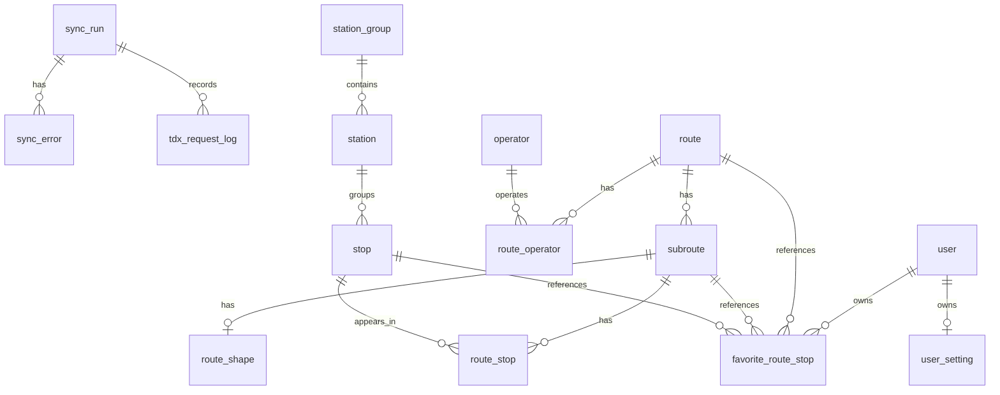

# Database Plan

This document records the planned database tables and relationships for the API.

It is not a Prisma schema yet. The goal is to make the data model easier to discuss before writing migrations.

## Scope

First database scope:

- `route`
- `subroute`
- `station_group`
- `station`
- `stop`
- `route_stop`
- `route_shape`
- sync records

Out of scope for the first database pass:

- realtime ETA cache
- realtime vehicle snapshots
- user accounts
- favorites sync
- settings sync

## General Rules

- Use `snake_case` for database columns.
- Use `uuid` for stable public or TDX identifiers.
- Use `id` for internal database relations.
- Define our own domain enums instead of storing TDX numeric enum values directly.
- Use `snake_case` string values for enums.
- Do not use numbers as database enum values.
- If a TDX raw code needs to be kept, store it as `tdx_*_code`.
- Name boolean columns as `is_*`.
- Store localized text as separate columns for now:
  - `name_zh_tw`
  - `name_en`
- Store coordinates as:
  - `latitude`
  - `longitude`
- Name timestamp columns as `*_at`.
- Store `*_at` values in UTC.
- Name duration or countdown columns by unit, such as `*_seconds`.
- Local clock times that are not exact timestamps can use `*_time`.
- Keep TDX update time as `tdx_updated_at`.
- Keep local row timestamps as `created_at` and `updated_at`.
- Use soft delete for base data that may be referenced by favorites:
  - `is_active`
  - `inactive_at`
- Favorite rows can be hard deleted when the user removes a favorite.

## Column And Type Rules

These are the planned database-level types. They can still be adjusted when writing the Prisma schema, but the API and database should follow the same naming direction.

### String Length

- `uuid`: `varchar(64)`
- TDX ID fields such as `tdx_route_id`, `tdx_stop_id`, `tdx_station_id`: `varchar(64)`
- name fields such as `name_zh_tw`, `name_en`, `name_ja`, `name_ko`, `departure_zh_tw`, and `destination_en`: `varchar(100)`
- address fields such as `address_zh_tw`, `address_en`: `varchar(255)`
- phone fields: `varchar(50)`
- URL fields: `text`
- free-form error messages: `text`
- original TDX payload or parsed path data: JSON

### Numeric Types

- `latitude`: `double precision`
- `longitude`: `double precision`
- ordered sequence fields such as `sequence` and `stop_sequence`: integer
- distance fields should include the unit in the name, such as `distance_meters`
- `distance_meters`: integer for user-facing nearby station distance
- count fields such as `records_read`, `records_created`, and `records_updated`: integer

Use `sequence` for ordered `route_stop` data. Avoid `order` as a column name.

### Time Types

- timestamp fields must use `*_at`
- `*_at` values are stored in UTC
- local clock time fields can use `*_time`
- duration or countdown fields should include the unit in the name
- duration or countdown fields should use integer values unless the API needs sub-second precision
- example: `first_bus_time`
- example: `estimated_arrival_seconds`

### Boolean Types

- Boolean columns should use `is_*`.
- Example: `is_active`.
- Avoid `has_*` unless the column really means the row owns or contains another resource.

### JSON Types

Use JSON only when the structure is naturally nested or comes from an external source.

Planned JSON fields:

- `route_shape.path`
- `route_shape.geometry`
- `sync_error.payload`

### Enums

Use our own enum values in the database and API. Convert TDX values during sync.

#### `direction`

TDX uses numeric direction values. The database should store string values.

- `go`
- `return`
- `loop`
- `shuttle`
- `unknown`

#### `bearing`

TDX may provide short direction codes. The database should store readable string values.

- `east`
- `west`
- `south`
- `north`
- `southeast`
- `northeast`
- `southwest`
- `northwest`
- `unknown`

#### `route_shape_source`

- `encoded_polyline`
- `geometry`
- `stop_positions`

#### `sync_resource`

- `routes`
- `stations`
- `stops`
- `shapes`

#### `sync_status`

- `queued`
- `running`
- `pending`
- `succeeded`
- `failed`

## Relationship Draft



## Current Decisions

### ORM

Use Prisma.

### Area

Do not store `area` in the first schema.

The API can map `area` to a list of cities when querying data.

### Station Group, Station, And Stop

Keep `station_group`, `station`, and `stop` as separate tables.

TDX has separate concepts for station groups, stations, and stops. They are different levels of location data, so the first schema should keep them separate instead of merging them into one table.

Relationship:

- `station_group` can contain many `station` rows.
- `station` can contain many `stop` rows.
- `stop` is the record used by `route_stop` for route sequence data.

Foreign keys should be nullable where TDX data is incomplete:

- `station.station_group_id` can be null.
- `stop.station_id` can be null.

This keeps both TDX UUIDs available while avoiding a hard assumption that every city has complete station group data.

### Route Shape

The frontend currently renders route paths as:

```ts
type LngLat = [longitude: number, latitude: number]
```

The current frontend transform prefers:

1. TDX `EncodedPolyline`
2. TDX `Geometry`
3. fallback from ordered stop positions

Store the readable path as JSON:

```json
[
  [121.4984, 25.0018],
  [121.5021, 25.0042]
]
```

Also keep the original TDX fields when available:

- `encoded_polyline`
- `geometry`
- `source`

`source` can be:

- `encoded_polyline`
- `geometry`
- `stop_positions`

### PostGIS

Do not use PostGIS in the first schema.

PostGIS is a PostgreSQL extension for geographic queries and spatial indexes. It may be useful later for nearby station search, but the first version can use normal `latitude` and `longitude` columns.

### Address Translation

Store translated English addresses, but do not translate on every sync.

Fields:

- `address_zh_tw`
- `address_en`

TDX does not provide the English address. `address_en` is translated from `address_zh_tw`.

When syncing, compare the incoming Chinese address with the stored `address_zh_tw`.

- If the Chinese address is unchanged, keep `address_en`.
- If the Chinese address changed, update `address_zh_tw`, clear `address_en`, and fall back to the Chinese address until it is translated again.

### Realtime Data

Do not store realtime snapshots in PostgreSQL in the first schema.

Use direct TDX calls or a short in-memory cache first. If deployment or cache needs become more complex, consider Redis later.

### Soft Delete

Use soft delete for base data.

Favorites may reference routes or stops. If TDX no longer returns a route or stop, keep the row and mark it inactive so the UI can show that the favorite item is no longer active.

This does not mean favorite rows need soft delete. If the user removes a favorite, delete that favorite row directly.

## Tables

### route

One bus route.

TDX source:

- `/v2/Bus/Route/City/{City}`

Fields:

- `id`
- `uuid`
- `tdx_route_id`
- `city`
- `name_zh_tw`
- `name_en`
- `name_ja`
- `name_ko`
- `departure_zh_tw`
- `departure_en`
- `departure_ja`
- `departure_ko`
- `destination_zh_tw`
- `destination_en`
- `destination_ja`
- `destination_ko`
- `is_active`
- `inactive_at`
- `tdx_updated_at`
- `created_at`
- `updated_at`

Relations:

- has many `subroute`
- has many `route_operator`

### subroute

One route direction or route variant.

TDX source:

- `SubRoutes` from `/v2/Bus/Route/City/{City}`
- route data from `/v2/Bus/StopOfRoute/City/{City}`

Fields:

- `id`
- `uuid`
- `tdx_subroute_id`
- `route_id`
- `direction`
- `name_zh_tw`
- `name_en`
- `name_ja`
- `name_ko`
- `departure_zh_tw`
- `departure_en`
- `departure_ja`
- `departure_ko`
- `destination_zh_tw`
- `destination_en`
- `destination_ja`
- `destination_ko`
- `first_bus_time`
- `last_bus_time`
- `is_active`
- `inactive_at`
- `tdx_updated_at`
- `created_at`
- `updated_at`

Relations:

- belongs to `route`
- has many `route_stop`
- has one `route_shape`

### station_group

A TDX station group.

TDX source:

- `/v2/Bus/StationGroup/City/{City}`

Fields:

- `id`
- `uuid`
- `tdx_station_group_id`
- `city`
- `name_zh_tw`
- `name_en`
- `name_ja`
- `name_ko`
- `latitude`
- `longitude`
- `is_active`
- `inactive_at`
- `tdx_updated_at`
- `created_at`
- `updated_at`

Relations:

- has many `station`

### station

A passenger-facing station or station location.

TDX source:

- `/v2/Bus/Station/City/{City}`
- can be derived from stop data when needed

Fields:

- `id`
- `uuid`
- `tdx_station_id`
- `station_group_id`: nullable
- `city`
- `name_zh_tw`
- `name_en`
- `name_ja`
- `name_ko`
- `address_zh_tw`
- `address_en`
- `latitude`
- `longitude`
- `bearing`
- `is_active`
- `inactive_at`
- `tdx_updated_at`
- `created_at`
- `updated_at`

Relations:

- belongs to `station_group`
- has many `stop`

### stop

A physical stop sign or TDX stop record.

TDX source:

- `/v2/Bus/Stop/City/{City}`
- stop data from `/v2/Bus/StopOfRoute/City/{City}`

Fields:

- `id`
- `uuid`
- `tdx_stop_id`
- `station_id`: nullable
- `city`
- `name_zh_tw`
- `name_en`
- `name_ja`
- `name_ko`
- `address_zh_tw`
- `address_en`
- `latitude`
- `longitude`
- `bearing`
- `is_active`
- `inactive_at`
- `tdx_updated_at`
- `created_at`
- `updated_at`

Relations:

- belongs to `station`
- has many `route_stop`

### route_stop

Join table between `subroute` and `stop`.

This is where the stop sequence belongs.

TDX source:

- `/v2/Bus/StopOfRoute/City/{City}`

Fields:

- `id`
- `subroute_id`
- `stop_id`
- `sequence`
- `is_active`
- `inactive_at`
- `tdx_updated_at`
- `created_at`
- `updated_at`

Indexes:

- unique `subroute_id + sequence`
- index `stop_id`
- index `subroute_id + sequence`

Relations:

- belongs to `subroute`
- belongs to `stop`

### route_shape

Shape path for a subroute.

Fields:

- `id`
- `subroute_id`
- `source`
- `path`
- `encoded_polyline`
- `geometry`
- `is_active`
- `inactive_at`
- `tdx_updated_at`
- `created_at`
- `updated_at`

Notes:

- `path` stores `[[longitude, latitude], ...]`.
- If TDX has no shape data, build the path from ordered stop positions.

### operator

A bus operator, such as Taipei Bus.

TDX source:

- `Operators` from `/v2/Bus/Route/City/{City}`

Fields:

- `id`
- `tdx_operator_id`
- `name_zh_tw`
- `name_en`
- `phone`
- `website_url`
- `is_active`
- `inactive_at`
- `created_at`
- `updated_at`

Relations:

- has many `route_operator`

### route_operator

Join table between `route` and `operator`.

Fields:

- `route_id`
- `operator_id`

Indexes:

- unique `route_id + operator_id`

## Sync Tables

Sync tables are not bus data.

They are logs for sync jobs. For example, when `/api/admin/sync/routes` runs, `sync_run` records when it started, whether it succeeded, and how many rows were created, updated, or marked inactive.

The sync implementation should start with `routes` and `stops`.

The admin endpoint should create a `sync_run` and return it quickly. The actual TDX import should run in the background so the HTTP request does not need to stay open while all cities are being synced.

Initial city scope can be Shuangbei first, then expand to all cities after the flow is stable. Full Taiwan sync is acceptable for base route and stop data because those records do not change often. A monthly sync cadence should be enough for the first version.

TDX basic member limits must be respected:

- request frequency: 5 requests per minute
- monthly points: 3 points
- bus API counting: 1 point per 1,500 requests, or 1 point per 150 MB

The TDX client layer should own pacing and quota checks. Feature sync services should ask the client for one TDX request at a time and should not implement their own sleep or quota math.

If quota is temporarily exhausted, update the sync run to `pending` and store the earliest retry time in `resume_after_at`.

Recommended first sync flow:

1. `POST /api/admin/sync/routes` or `POST /api/admin/sync/stops` creates a queued `sync_run`.
2. A background sync service marks the run as `running`.
3. The route or stop sync service asks the TDX client for one request at a time.
4. The TDX client checks minute and monthly quota before each request.
5. The TDX client writes one `tdx_request_log` row per upstream request.
6. Mappers convert TDX payloads into Prisma-friendly records.
7. Sync services upsert active records.
8. Records missing from the latest TDX response are marked `is_active = false` and get `inactive_at`.
9. If a previously inactive record appears again, mark `is_active = true` and clear `inactive_at`.
10. When all work is done, update the run to `succeeded`.
11. If a recoverable quota limit is hit, update the run to `pending`.
12. If an unexpected error happens, update the run to `failed`.

Use separate mappers for different boundaries:

- TDX to database sync records: close to Prisma fields and database naming.
- Database records to API response models: close to frontend page-ready contracts.

### sync_run

One sync attempt.

Fields:

- `id`
- `resource`
- `status`
- `started_at`
- `finished_at`
- `resume_after_at`
- `records_read`
- `records_created`
- `records_updated`
- `records_deactivated`
- `error_message`
- `created_at`
- `updated_at`

Possible `resource` values:

- `routes`
- `stops`
- `stations`
- `shapes`

Possible `status` values:

- `queued`
- `running`
- `pending`
- `succeeded`
- `failed`

Use `pending` when a sync run is paused because it can continue later, such as when TDX request quota is temporarily exhausted. Store the next possible resume time in `resume_after_at`.

### sync_error

One error inside a sync run.

This is useful when a sync mostly works, but one or more TDX records cannot be parsed or saved.

Fields:

- `id`
- `sync_run_id`
- `resource`
- `tdx_uuid`
- `message`
- `payload`
- `created_at`

Relations:

- belongs to `sync_run`

### tdx_request_log

One upstream TDX request.

This table is used for quota tracking and diagnostics. It should be written by the TDX client layer, not by individual feature sync services.

Fields:

- `id`
- `sync_run_id`
- `resource`
- `method`
- `path`
- `status_code`
- `request_bytes`
- `response_bytes`
- `duration_ms`
- `requested_at`
- `error_message`

Relations:

- optionally belongs to `sync_run`

Quota checks can use this table to count requests and response bytes for the current month. Minute-level pacing still belongs in the TDX client layer.

The TDX client may keep short-lived in-memory state for minute pacing, but monthly quota should be calculated from persisted request logs so a server restart does not forget usage.

## Later Tables

These are not part of the first database pass.

### vehicle

Vehicle data is realtime-related, so it is later scope.

Fields:

- `id`
- `uuid`
- `plate_number`
- `city`
- `created_at`
- `updated_at`

### user

Fields:

- `id`
- `uuid`
- `name`
- `email`
- `password_hash`
- `created_at`
- `updated_at`

### favorite_route_stop

Fields:

- `id`
- `uuid`
- `user_id`
- `route_id`
- `subroute_id`
- `stop_id`
- `direction`
- `stop_sequence`
- `created_at`
- `updated_at`

Indexes:

- unique `user_id + route_id + subroute_id + stop_id + direction`

Notes:

- If the user removes a favorite, delete this row directly.
- Soft delete is for referenced bus data such as routes, subroutes, stops, and `route_stop` rows.

### user_setting

Fields:

- `id`
- `user_id`
- `locale`
- `is_google_analytics_enabled`
- `created_at`
- `updated_at`

## API Mapping

### `GET /api/routes?area=...`

Reads:

- `route`

Flow:

1. Map `area` to cities.
2. Query active routes by city.
3. Return route summary data.

### `GET /api/routes/:uuid`

Reads:

- `route`
- `subroute`
- `route_stop`
- `stop`
- `route_shape`

Returns:

- route name and terminals
- subroutes
- ordered stops
- stop positions
- shape path

### `GET /api/stations?latitude=...&longitude=...`

Reads:

- `station`
- `station_group`
- `stop`
- `route_stop`
- `subroute`
- `route`

Flow:

1. Find nearby stations by coordinates.
2. Find stops under those stations.
3. Use `route_stop` rows to find routes and directions.
4. Return nearby station data.

### `POST /api/admin/sync/routes`

Writes:

- `sync_run`
- `tdx_request_log`
- `route`
- `subroute`
- `operator`
- `route_operator`
- `route_shape`

### `POST /api/admin/sync/stops`

Writes:

- `sync_run`
- `tdx_request_log`
- `station_group`
- `station`
- `stop`
- `route_stop`
- `route_shape`

## Follow-up Quality Checks

Add API workspace quality scripts after the first Prisma schema foundation is reviewed.

Planned scripts:

- `lint`
- `typecheck`
- `test`
- `test:e2e`
- `prisma:format`
- `prisma:validate`

Prisma schema formatting should use `prisma format`.

Prisma schema validation should use `prisma validate`.

Consider Husky integration after the API scripts are stable:

- `pre-commit` can run API lint, typecheck, and Prisma validation only when API files are staged.
- Prisma formatting can be manual first.
- If format enforcement is needed later, use a check that runs `prisma format` and fails when it creates a git diff.

Keep CI changes separate from the first Prisma schema PR. Add API CI after the local scripts are stable.

## Operational Setup

These are the practical setup items needed before the backend can run outside local development.

- Create or confirm the managed PostgreSQL project.
- Create or confirm the backend hosting project.
- Set local API environment variables in `.env.local`.
- Set deployment environment variables in the hosting provider.
- Keep shared values in `.env.example`, but never commit real secrets.
- Confirm how the deployed API connects to PostgreSQL.
- Confirm how Prisma migrations will run for the deployed database.
- Confirm how manual admin sync endpoints are protected before they can modify data.
- Decide where scheduled sync jobs will run after the manual sync flow works.
- Keep deployment and scheduled jobs separate from the first sync API contract pass.

## Plan Order

1. Add sync API contract stubs for planned admin sync endpoints.
2. Add Prisma migrations for the current schema.
3. Add Prisma service integration in the API workspace.
4. Persist `sync_run` records from sync endpoints.
5. Add TDX request logging and quota-aware sync status fields.
6. Implement the TDX client boundary.
7. Implement route sync from TDX for the first city scope.
8. Implement stop, station, station group, and route stop sync from TDX for the first city scope.
9. Expand sync city scope after the first city scope is stable.
10. Add small seed data or synced sample data for route search.
11. Read `GET /api/routes?area=...` from the database.
12. Read `GET /api/routes/:uuid` from the database.
13. Read `GET /api/stations?latitude=...&longitude=...` from the database.
14. Discuss realtime cache.
15. Discuss auth, favorites, and settings.
