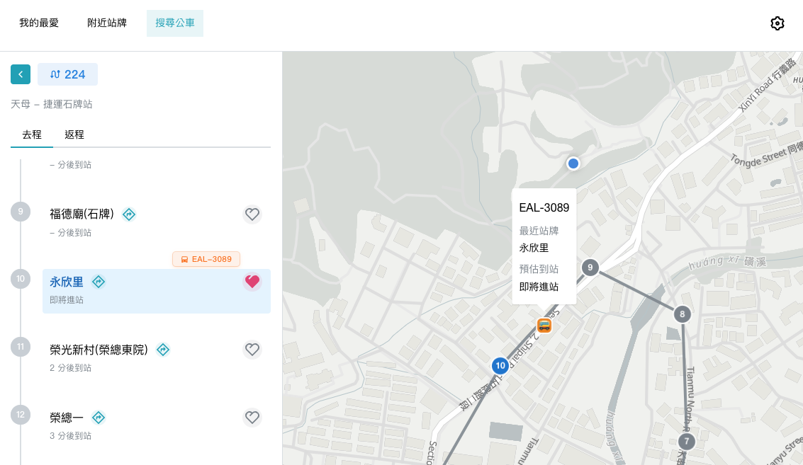

# Finding the Bus

[English](../README.md) | [繁體中文](./README.zh-TW.md)

這是一個查詢台灣公車路線的應用。一開始是單純的前端專案，現在正在慢慢長成前後端分工更清楚的 monorepo。

目前正式上線的是 React Router 前端，提供路線搜尋、附近站牌、收藏、語言設定與即時公車資訊。接下來會逐步加入後端、資料庫同步，以及前後端共用的 API contract。

## Workspaces

```text
apps/
├── web/          # React Router 前端
├── tdx-proxy/    # TDX 驗證用的 Cloudflare Worker proxy
└── api/          # 待開發 NestJS 後端

packages/
└── shared/       # 待開發共用 API contract 與型別
```

## Workspace 文件

| Workspace | 用途 | 文件 |
| --- | --- | --- |
| `apps/web` | 使用者介面的 React Router app | [apps/web/README.md](../apps/web/README.md) |
| `apps/tdx-proxy` | TDX 驗證用 Cloudflare Worker proxy | [apps/tdx-proxy/README.md](../apps/tdx-proxy/README.md) |
| `apps/api` | 預計導入的 NestJS 後端 | [apps/api/README.md](../apps/api/README.md) |
| `packages/shared` | 預計放共用 API contract 與 domain types | [packages/shared/README.md](../packages/shared/README.md) |

如果想了解後端與資料庫的規劃，可以先看 [docs/plan.md](./plan.md)。

## 如何使用

直接前往 [bus.lynns.me](https://bus.lynns.me) 即可開始使用目前的前端版本。



## 設定

安裝依賴：

```bash
pnpm install
```

設定本地 TDX proxy。這一步是為了讓本機開發時也能透過 Worker proxy 取得 TDX 資料，而不是把 TDX credentials 放進前端：

```bash
cp apps/tdx-proxy/.dev.vars.example apps/tdx-proxy/.dev.vars
```

接著在 `.dev.vars` 裡填入 `TDX_CLIENT_ID` 與 `TDX_CLIENT_SECRET`。

## 開發

一般開發可以從 root 啟動，這會同時跑前端 dev server 與本地 Worker proxy：

```bash
pnpm run dev
```

如果要用同一個區域網路裡的手機測試：

```bash
pnpm run dev:mobile
```

## 檢查

如果想確認整個 workspace 目前狀態，可以跑：

```bash
pnpm run lint
pnpm run typecheck
pnpm run test
```

如果這次只改到前端，可以只跑 web workspace：

```bash
pnpm --filter @bus/web lint
pnpm --filter @bus/web typecheck
pnpm --filter @bus/web test
```

## 部署

GitHub Actions workflow 目前只會 build 並部署 `@bus/web` 到 GitHub Pages。

TDX proxy 目前仍維持手動部署，避免每次前端部署都連動 Worker：

```bash
pnpm --filter @bus/tdx-proxy deploy
```

NestJS 後端尚未開始部署。
